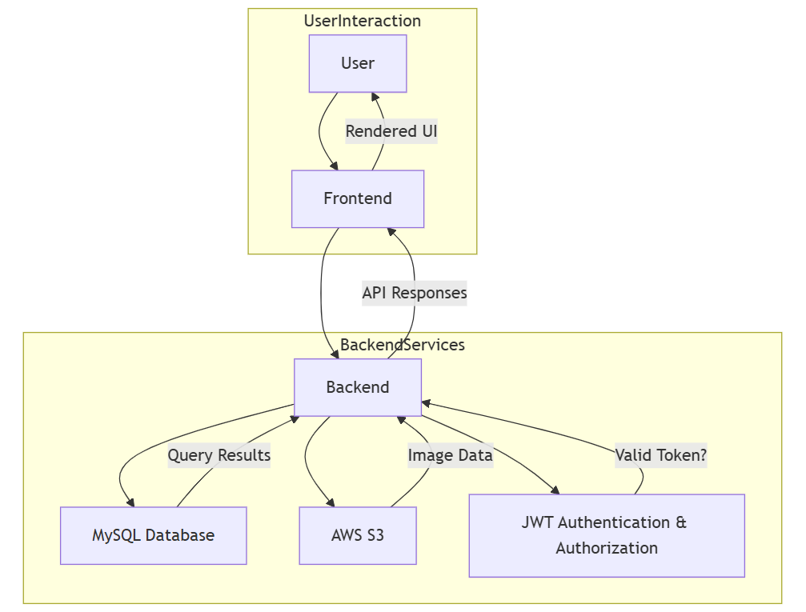

# E-Commerce Backend

This repository contains the backend services for the E-Commerce platform, developed using Spring Boot. It provides RESTful APIs for managing products, users, orders, and other core functionalities of the application.

The frontend for this project is available at: [E-Commerce Frontend](https://github.com/QI-D/ecommerce-frontend)

## Table of Contents

- [Architecture Diagram](#architecture-diagram)
- [Features](#features)
- [Technologies Used](#technologies-used)
- [Getting Started](#getting-started)
  - [Prerequisites](#prerequisites)
  - [Installation](#installation)
  - [Running The Application](#4-running-the-application)
- [Deployment](#deployment)
- [API Documentation](#api-documentation)
- [Contributing](#contributing)
- [License](#license)

## Architecture Diagram

The following diagram provides an overview of the system architecture:



## Features

- **User Management**: Registration, authentication, and profile management.
- **Product Management**: Manage products with CRUD operations.
- **Order Processing**: Create and manage orders.
- **Category Management**: Organize products into categories.
- **Address Management**: Manage user addresses.
- **Security**: JWT-based authentication and authorization.
- **AWS S3 Integration**: Store and retrieve product images from AWS S3.

## Technologies Used

- **Java 17**
- **Spring Boot 3**
- **Spring Security**
- **JPA/Hibernate**
- **MySQL**
- **Maven**
- **AWS**

## Getting Started

### Prerequisites

- **Java 17**: Ensure you have Java Development Kit (JDK) 17 installed.
- **MySQL**: A running MySQL database instance.
- **Maven**: For building and managing dependencies.
- **AWS Account**: Required for S3 storage.

### Installation

#### 1. Clone the Repository

```bash
git clone https://github.com/QI-D/ecommerce-backend.git
cd ecommerce-backend
```

#### 2. Create a `.env` File

Create a `.env` file in the root directory with the following environment variables. **Customize the values according to your setup:**

```ini
DB_URL=jdbc:mysql://<DB_URL>
DB_USERNAME=<DB_USERNAME>
DB_PASSWORD=<DB_PASSWORD>
ADMIN_USER=<ADMIN_USER>
ADMIN_PASSWORD=<ADMIN_PASSWORD>
SECRET_JWT_STRING=<SECRET_JWT_STRING>
AWS_S3_ACCESS_KEY_ID=<AWS_S3_ACCESS_KEY_ID>
AWS_S3_SECRET_ACCESS_KEY=<AWS_S3_SECRET_ACCESS_KEY>
AWS_S3_BUCKET_NAME=<AWS_S3_BUCKET_NAME>
AWS_REGION=<AWS_REGION>
```

Ensure you replace the above values with your actual database credentials, admin credentials, JWT secret, and AWS S3 access keys.

#### 3. Install the Dependencies

```bash
mvn clean install
```

#### 4. Running the Application

```bash
mvn spring-boot:run
```

The server should start on `http:localhost:8080`.

## Deployment

To deploy the E-Commerce platform backend and frontend services using Docker, follow the steps below.

### Prerequisites

- **Docker**: Ensure Docker is installed and running on your system.
- **Docker Compose**: Docker Compose is required to manage multi-container Docker applications.
- **Git**: Ensure Git is installed to clone the repositories.

### Cloning the Repositories

1.  Clone the backend repository:

    ```bash
    git clone https://github.com/QI-D/ecommerce-backend.git
    ```

2.  Clone the frontend repository:

    ```bash
    git clone https://github.com/QI-D/ecommerce-frontend.git
    ```

3.  Place both the ecommerce-backend and ecommerce-frontend directories in a common parent directory.

    Example structure:

        /ecommerce
            /ecommerce-backend
            /ecommerce-frontend

### Running the Deployment

1. Navigate to the ecommerce-backend directory where the `docker-compose.yml` file is located.

   ```bash
   cd ecommerce-backend
   ```

2. Create a .env file in the root directory with the following environment variables. Customize the values according to your setup:

   ```ini
    DB_URL=jdbc:mysql://<DB_URL>
    DB_NAME=<DB_NAME>
    DB_USERNAME=<DB_USERNAME>
    DB_PASSWORD=<DB_PASSWORD>
    ADMIN_USER=<ADMIN_USER>
    ADMIN_PASSWORD=<ADMIN_PASSWORD>
    SECRET_JWT_STRING=<SECRET_JWT_STRING>
    AWS_S3_ACCESS_KEY_ID=<AWS_S3_ACCESS_KEY_ID>
    AWS_S3_SECRET_ACCESS_KEY=<AWS_S3_SECRET_ACCESS_KEY>
    AWS_S3_BUCKET_NAME=<AWS_S3_BUCKET_NAME>
    AWS_REGION=<AWS_REGION>
   ```

3. Run the following command to start the backend, frontend, and MySQL services:

   ```bash
   docker-compose up --build
   ```

   This command will:

   - Build the Docker images for the backend and frontend.
   - Start the services defined in the docker-compose.yml file.
   - Expose the backend service on port 8080 and the frontend service on port 3000.

4. Access the application:

   - The backend will be available at `http://localhost:8080`.
   - The frontend will be available at `http://localhost:3000`.

### Stopping the Services

To stop the running services, use the following command:

```bash
docker-compose down
```

## API Documentation

### Authentication

| Method | API Endpoint     | Description                            |
| ------ | ---------------- | -------------------------------------- |
| POST   | `/auth/register` | Register a new user                    |
| POST   | `/auth/login`    | Authenticate user and return JWT token |

### User Management

| Method | API Endpoint    | Description                               |
| ------ | --------------- | ----------------------------------------- |
| GET    | `/user/get-all` | Retrieve all users (Admin only)           |
| GET    | `/user/my-info` | Get current user's info and order history |

### Category Management

| Method | API Endpoint                        | Description                        |
| ------ | ----------------------------------- | ---------------------------------- |
| GET    | `/category/get-all`                 | Retrieve all categories            |
| GET    | `/category/get-category-by-id/{id}` | Get a category by ID               |
| POST   | `/category/create`                  | Create a new category (Admin only) |
| PUT    | `/category/update/{id}`             | Update a category (Admin only)     |
| DELETE | `/category/delete/{id}`             | Delete a category (Admin only)     |

### Product Management

| Method | API Endpoint                        | Description                                |
| ------ | ----------------------------------- | ------------------------------------------ |
| GET    | `/product/get-product-by-id/{id}`   | Get product details by ID                  |
| GET    | `/product/get-all`                  | Retrieve all products                      |
| GET    | `/product/get-by-category-id/{id}`  | Get products by category ID                |
| GET    | `/product/search?searchValue=value` | Search for products by name or description |
| POST   | `/product/create`                   | Create a new product (Admin only)          |
| PUT    | `/product/update`                   | Update an existing product (Admin only)    |
| DELETE | `/product/delete/{id}`              | Delete a product (Admin only)              |

### Address Management

| Method | API Endpoint    | Description                 |
| ------ | --------------- | --------------------------- |
| POST   | `/address/save` | Save or update user address |

### Order Management

| Method | API Endpoint                                | Description                                       |
| ------ | ------------------------------------------- | ------------------------------------------------- |
| POST   | `/order/create`                             | Place a new order                                 |
| PUT    | `/order/update-item-status/{id}?status=xyz` | Update order item status (Admin only)             |
| GET    | `/order/filter`                             | Filter order items based on criteria (Admin only) |

## Contributing

Contributions are welcome! Please fork the repository and submit a pull request for any enhancements or bug fixes.

## License

This project is licensed under the **MIT License**. See the [LICENSE](./LICENSE) file for details.
